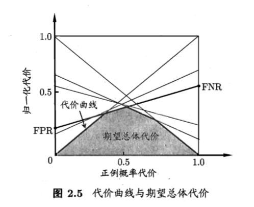
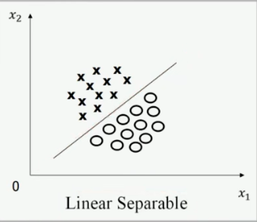

# AI学习-西瓜书

> GuoXu
> 2022.3.11
> AI 学习初步接触，希望通过学习，可以对AI机器学习有一个较深的认识，可以去完成相应的任务。

## 一、绪论

## 二、模型评估与选择

### 2.3 性能度量

对机器学习泛化能力的评估

- 均方误差：**回归任务**最常用的性能度量方法

#### 2.3.1 错误率和精度

  分类任务中最常用的两种**性能度量**

####   2.3.2 查全率与查准率

  已查准率为纵轴，查全率为横轴作图，“P-R”曲线

#### 2.3.3 ROC 与 AUC

  对于不同任务，采用不同的 截断点 

  ROC曲线 纵轴是 “真正例率”， 横轴是 “假正例率”

#### 2.3.4 代价敏感错误率与代价曲线

  对与不同分类错误 的代价进行区分，而不像之前的均等代价。

  

  

### 2.4 比较检验

得到的性能如何进行比较呢？

####   2.4.1 假设检验

  

## 三、支持向量机

### 3.1 线性可分

（二维情况下）是否存在一条直线，将样本进行区分。

（三维情况下）平面

（>= 四维的情况下）超平面

​                              

二维情况下的线性可分与不可分

  

$w_1x_1 + w_2x_2 + b < 0$  与 $w_1x_1 + w_2x_2 + b > 0$  所代表的的$c_1 与 c_2$ 是人为规定的。

### 3.2 问题描述

寻找最好的那一条直线方程（平面或者是超平面）

**最优分类超平面应该满足**

- 该超平面分开了两类

- 该超平面偶最大化间隔

- 该超平面处于间隔的中间，到所有支持向量距离相等

    

  线性可分情况下，支持向量机寻找最佳超平面的又换问题可以表示为：
  $$
  最小化(Minimize):\frac{1}{2} ||w||^2\\
    限制条件:y_i=(w^Tx_i+b)\geq1,(i=1 \~ N)
  $$
  

### 3.3 线性不可分情况

在线性不可分的情况下，以上问题是无解的，不存在 w 和 b 满足上面所有的 N 个限制条件，这就需要我们适当的放松限制条件，使得上面的问题有解。

基本思路：对每个训练样本及标签 $(x_i,y_i)$ 加入 **松弛变量** **$ \delta_i $** (slack variable) 
$$
限制条件改为：y_i=(w^Tx_i+b)\geq 1 - \delta_i ,(i=1 \~ N)
$$
可以看到，$\delta_i$ 只要取得足够大，一定可以使得上述条件成立，但我们也需要加入一定的限制条件，防止 $\delta_i$ 无限的大。 

> 改造后的优化版本
>
> 
>
> 比例因子 **$C$** 为人为设定的 起到平衡两项的作用

**人为设定的参数：算法的超参数 （HYPER PARAMETER）**

在实际使用中要 不断调整 $C$ 的值 来使得算法达到比较优化的程度。

   

$C = 10000$ 使得 $\delta_i$ 的取值趋向于 0 ，分类面如图。

- 是否是一个曲面进行区分
- 时候可以将空间进行变换，使得目标线性可分

### 3.4 低维到高维的映射

进一步思考，支持向量机如何扩大可选函数的范围，从而提高处理非线性数据集的能力。——独树一帜

其他机器学习算法 如人工神经网络、决策树等，采用的是直接产生更多可选函数的方法。

- 人工神经网络，通过多层非线性函数的组合，能够产生椭圆这样的非线性曲线

    

**支持向量机** 则是 将特征空间 由**低维**映射到高维 任然用**线性超平面**对数据进行分类。

> 如下例子
>
> 特征空间分布如下图：
>
> 线性不可分
>
> 
>
> **进行线性变换**
>
> 构造一个二维到五维的映射$\phi(x)$
> $$
> \phi(x):~~~~~ x = \begin{bmatrix} a  \\ b\\ \end{bmatrix} \begin{CD} @>>> \phi(x)=\begin{bmatrix} a^2\\ b^2\\ a\\ b\\ ab\\ \end{bmatrix}\end{CD}
> $$
> 当映射成五维的情况下，变成线性可分的了。
>
> 
>
> 更一般的结论：
>
> 
>
>   **特征空间的维度 M 的增加 带估计参数（w,b) 的维度也会增加，整个算法的自由度也会增加**
>
> 
>
> 

### 3.5 核函数的定义

具体研究 $\phi(x_i)$ 的形式，以此来引出 **核函数 （Kernel Function)**

#### 3.5.1 什么是核函数

可以不知道 $\phi(x_i)$ 的具体形式，取而代之的是对于任意两个向量 $ X_1 X_2$ 有
$$
K(X_1,X_2) = \phi(X_1)^T\phi(X_2)
$$
我们任然可以通过一些技巧来获取测试样本 X 的类别信息，从而完成对样本类别的预测。

 在这里，我们定义 $K(X_1,X_2)$ 为核函数，它是一个实数。

#### 3.5.2 核函数的作用

- 已知映射求核函数

- 已知核函数求映射

**可以看出，核函数与映射是一一对应的关系，知道一个可以求另一个。**

####  3.5.3 核函数分解的条件

Mercer's Theorem 定理

满足以上条件的核函数，可以分解成两个向量积的形式。

### 3.6 原问题与对偶问题

**原问题** Prime Problem

**对偶问题** Dual Problem

我们定义 $f(w^*) - \theta(\alpha^*,\beta^*)$ 为 **对偶差距 （Duality Gap）**

- 强对偶定理

    

