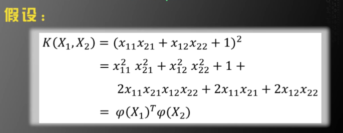
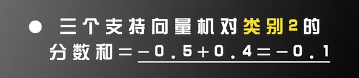
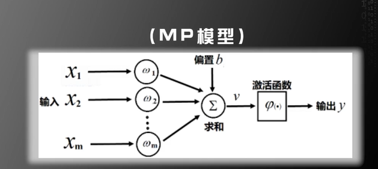
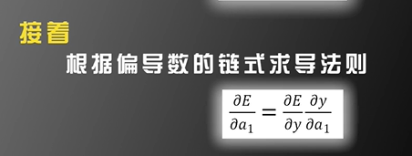
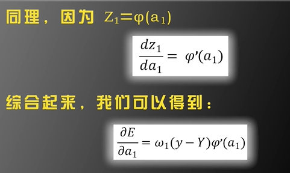
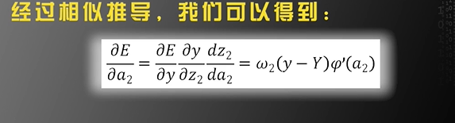
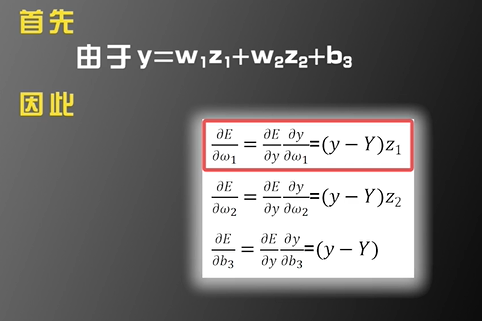

<script type="text/javascript" src="http://cdn.mathjax.org/mathjax/latest/MathJax.js?config=default"></script>
# AI学习-西瓜书

> GuoXu
> 2022.3.11
> AI 学习初步接触，希望通过学习，可以对AI机器学习有一个较深的认识，可以去完成相应的任务。

## 一、绪论


## 二、模型评估与选择

### 2.3 性能度量

对机器学习泛化能力的评估

- 均方误差：**回归任务**最常用的性能度量方法


#### 2.3.1 错误率和精度

  分类任务中最常用的两种**性能度量**

####   2.3.2 查全率与查准率

  已查准率为纵轴，查全率为横轴作图，“P-R”曲线


#### 2.3.3 ROC 与 AUC

  对于不同任务，采用不同的 截断点 

  ROC曲线 纵轴是 “真正例率”， 横轴是 “假正例率”


#### 2.3.4 代价敏感错误率与代价曲线

  对与不同分类错误 的代价进行区分，而不像之前的均等代价。

  

  

### 2.4 比较检验

得到的性能如何进行比较呢？

####   2.4.1 假设检验

****

  

## 三、支持向量机

### 3.1 线性可分

（二维情况下）是否存在一条直线，将样本进行区分。

（三维情况下）平面

（>= 四维的情况下）超平面

​                              

二维情况下的线性可分与不可分

  

$w_1x_1 + w_2x_2 + b < 0$  与 $w_1x_1 + w_2x_2 + b > 0$  所代表的的$c_1 与 c_2$ 是人为规定的。

### 3.2 问题描述

寻找最好的那一条直线方程（平面或者是超平面）

**最优分类超平面应该满足**

- 该超平面分开了两类

- 该超平面偶最大化间隔

- 该超平面处于间隔的中间，到所有支持向量距离相等

    

  线性可分情况下，支持向量机寻找最佳超平面的又换问题可以表示为：
  $$
  最小化(Minimize):\frac{1}{2} ||w||^2\\
    限制条件:y_i=(w^Tx_i+b)\geq1,(i=1 \~ N)
  $$
  

### 3.3 线性不可分情况

在线性不可分的情况下，以上问题是无解的，不存在 w 和 b 满足上面所有的 N 个限制条件，这就需要我们适当的放松限制条件，使得上面的问题有解。

基本思路：对每个训练样本及标签 $(x_i,y_i)$ 加入 **松弛变量** **$ \delta_i $** (slack variable) 
$$
限制条件改为：y_i=(w^Tx_i+b)\geq 1 - \delta_i ,(i=1 \~ N)
$$
可以看到，$\delta_i$ 只要取得足够大，一定可以使得上述条件成立，但我们也需要加入一定的限制条件，防止 $\delta_i$ 无限的大。 

> 改造后的优化版本
>
> 
>
> 比例因子 **$C$** 为人为设定的 起到平衡两项的作用

**人为设定的参数：算法的超参数 （HYPER PARAMETER）**

在实际使用中要 不断调整 $C$ 的值 来使得算法达到比较优化的程度。

   

$C = 10000$ 使得 $\delta_i$ 的取值趋向于 0 ，分类面如图。

- 是否是一个曲面进行区分
- 时候可以将空间进行变换，使得目标线性可分

### 3.4 低维到高维的映射

进一步思考，支持向量机如何扩大可选函数的范围，从而提高处理非线性数据集的能力。——独树一帜

其他机器学习算法 如人工神经网络、决策树等，采用的是直接产生更多可选函数的方法。

- 人工神经网络，通过多层非线性函数的组合，能够产生椭圆这样的非线性曲线

    

**支持向量机** 则是 将特征空间 由**低维**映射到高维 任然用**线性超平面**对数据进行分类。

> 如下例子
>
> 特征空间分布如下图：
>
> 线性不可分
>
> 
>
> **进行线性变换**
>
> 构造一个二维到五维的映射$\phi(x)$
> $$
> \phi(x):~~~~~ x = \begin{bmatrix} a  \\ b\\ \end{bmatrix} \begin{CD} @>>> \phi(x)=\begin{bmatrix} a^2\\ b^2\\ a\\ b\\ ab\\ \end{bmatrix}\end{CD}
> $$
> 当映射成五维的情况下，变成线性可分的了。
>
> 
>
> 更一般的结论：
>
> 
>
>   **特征空间的维度 M 的增加 带估计参数（w,b) 的维度也会增加，整个算法的自由度也会增加**
>
> 
>
> 

### 3.5 核函数的定义

具体研究 $\phi(x_i)$ 的形式，以此来引出 **核函数 （Kernel Function)**

#### 3.5.1 什么是核函数

可以不知道 $\phi(x_i)$ 的具体形式，取而代之的是对于任意两个向量 $ X_1 X_2$ 有
$$
K(X_1,X_2) = \phi(X_1)^T\phi(X_2)
$$
我们任然可以通过一些技巧来获取测试样本 X 的类别信息，从而完成对样本类别的预测。

 在这里，我们定义 $K(X_1,X_2)$ 为核函数，它是一个实数。

#### 3.5.2 核函数的作用

- 已知映射求核函数


- 已知核函数求映射




**可以看出，核函数与映射是一一对应的关系，知道一个可以求另一个。**

####  3.5.3 核函数分解的条件

Mercer's Theorem 定理


满足以上条件的核函数，可以分解成两个向量积的形式。

### 3.6 原问题与对偶问题

**原问题** Prime Problem


**对偶问题** Dual Problem


我们定义 $f(w^*) - \theta(\alpha^*,\beta^*)$ 为 **对偶差距 （Duality Gap）**

- 强对偶定理

    

### 3.7 转化为对偶问题

 将支持向量机的原问题转化为对偶问题

#### 3.7.1 转化条件

支持向量机的原问题满足强对偶定理


我们要将之前的优化问题转化为原问题，限制条件的转化。


#### 3.7.2 具体转化

接下来使用上一节中的对偶理论求解对偶问题

自变量 $w = (w,b,\delta_i)$ 

原问题中的 $g_i(w)$ 比分为了两部分，


由于没有等式的情况，所有没有 $h_i(w)$ 的部分，$\alpha_i$ 也被分为了 $\alpha_i,\beta_i$ 两部分。


#### 3.7.3  如何化为对偶问题


将获得的三个等式带入到表达当中得到如下 


### 3.8 算法总体流程

支持向量机的统一算法流程

1.  首先 $\phi(X_i)^T\phi(X_j)=K(X_i,X_j)$ 只需要知道核函数，就可以求解最优化  问题了


#### 3.8.2 训练流程


求出 $ \alpha_i$ 之后再求出  $b$ 


求出  $ \alpha_i，b$ 之后就完成了训练的过程

接下来就是进行测试


### 3.9 国际象棋兵王问题

使用支持向量机进行实际问题的学习

#### 3.9.1 兵王问题阐述

使用 SVM（支持向量机） 解决兵王问题

- 国际象棋的规则 

- **兵王问题：**
	> 黑方只剩一个王
	>
	> 白方剩一个兵，一个王
	>
	> 将有两种可能：1. 白方将死黑方，白方胜。 2. 和棋

	在不输入规则的情况下，就可以使用支持向量机来判断这两种情况。

- 标注好的数据

  [UCI machine learning](https://archive.ics.uci.edu/ml/index.php) 数据集 可以下载数据集 [*krkopt.data*](https://archive.ics.uci.edu/ml/machine-learning-databases/chess/king-rook-vs-king/) 

- 标签设定

    和棋（draw） $y_i=+1$

    其他（others）$y_i=-1$

    

- 使用 LIBSVM 工具包 进行训练

    支持MATLAB，C++，python
    
    [下载地址](https://www.csie.ntu.edu.tw/~cjlin/libsvm/)
    
    MATLAB 安装

#### 3.9.2 程序参数设置

1. **对数据进行预处理**

    随机取5000个样本进行训练，其余样本进行测试

2. **对训练样本归一化**

     在训练样本上，求出每个维度的均值和方差，在训练和测试样本上同时归一化。
    $$
    newX=\frac{X-mean(X)}{std(X)}
    $$
    训练样本归一化（normalization of training data）可以将输入特征的每个维度限定在一个固定的范围内，从而减少因为每个维度动态范围的不同而引起的训练误差

3. **SVM的几个重要的参数**

    

    


- Linear 线性内核，具有理论意义，而没有实际意义。
- Ploy 多项式核  复杂度可以调剂，可以通过调节 d 的大小来改变
- Rbf 高斯径向基函数核  超参数 $\sigma$ ，维度是无限的，不知道使用什么核函数，优先使用 Rbf
- Tanh  维度也是无限的


由于支持向量机的优化问题如下


如果知道这个矩阵，也可以使用 **自定义核 “ - t 4 ”** 进行计算


​	 **- g** 设定 gamma 的值，其中 gamma 的方程与 **- t** 的设定有关

#### 3.9.3 编写MATLAB 程序求解兵王问题

- 安转 LIBSVM 
- MATLAB 程序

```matlab
clear all;
% Read the data.
fid  =  fopen('krkopt.DATA');
c = fread(fid, 3);

vec = zeros(6,1);
xapp = [];
yapp = [];
while ~feof(fid)
    string = [];
    c = fread(fid,1);
    flag = flag+1;
    while c~=13
        string = [string, c];
        c=fread(fid,1);
    end;
    fread(fid,1);  
    if length(string)>10
        vec(1) = string(1) - 96;
        vec(2) = string(3) - 48;
        vec(3) = string(5) - 96;
        vec(4) = string(7) - 48;
        vec(5) = string(9) - 96;
        vec(6) = string(11) - 48;
        xapp = [xapp,vec];
        if string(13) == 100
            yapp = [yapp,1];
        else
            yapp = [yapp,-1];
        end;
    end;
end;
fclose(fid);

[N,M] = size(xapp);

p = randperm(M); % 直接打乱了训练样本
numberOfSamplesForTraining = 5000;
xTraining = [];
yTraining = [];
for i=1:numberOfSamplesForTraining
    xTraining  = [xTraining,xapp(:,p(i))];
    yTraining = [yTraining,yapp(p(i))];
end
xTraining = xTraining';
yTraining = yTraining';

xTesting = [];
yTesting = [];
for i=numberOfSamplesForTraining+1:M
    xTesting  = [xTesting,xapp(:,p(i))];
    yTesting = [yTesting,yapp(p(i))];
end
xTesting = xTesting';
yTesting = yTesting';

%%%%%%%%%%%%%%%%%%%%%%%%
%Normalization
[numVec,numDim] = size(xTraining);
avgX = mean(xTraining);
stdX = std(xTraining);
for i = 1:numVec
    xTraining(i,:) = (xTraining(i,:)-avgX)./stdX;
end
[numVec,numDim] = size(xTesting);

for i = 1:numVec
    xTesting(i,:) = (xTesting(i,:)-avgX)./stdX;
end;


%%%%%%%%%%%%%%%%%%%%%%%%%%%%%%%%%%
%SVM Gaussian kernel 
%Search for the optimal C and gamma, K(x1,x2) = exp{-||x1-x2||^2/gamma} to
%make the recognition rate maximum. 

%Firstly, search C and gamma in a crude scale (as recommended in 'A practical Guide to Support Vector Classification'))
CScale = [-5, -3, -1, 1, 3, 5,7,9,11,13,15];
gammaScale = [-15,-13,-11,-9,-7,-5,-3,-1,1,3];
C = 2.^CScale;
gamma = 2.^gammaScale;
maxRecognitionRate = 0;
for i = 1:length(C)
    for j = 1:length(gamma)
        cmd=['-t 2 -c ',num2str(C(i)),' -g ',num2str(gamma(j)),' -v 5'];
        recognitionRate = svmtrain(yTraining,xTraining,cmd);
        if recognitionRate > maxRecognitionRate
            maxRecognitionRate = recognitionRate
            maxCIndex = i;
            maxGammaIndex = j;
        end
    end
end

%Then search for optimal C and gamma in a refined scale. 
n = 10;
minCScale = 0.5*(CScale(max(1,maxCIndex-1))+CScale(maxCIndex));
maxCScale = 0.5*(CScale(min(length(CScale),maxCIndex+1))+CScale(maxCIndex));
newCScale = [minCScale:(maxCScale-minCScale)/n:maxCScale];

minGammaScale = 0.5*(gammaScale(max(1,maxGammaIndex-1))+gammaScale(maxGammaIndex));
maxGammaScale = 0.5*(gammaScale(min(length(gammaScale),maxGammaIndex+1))+gammaScale(maxGammaIndex));
newGammaScale = [minGammaScale:(maxGammaScale-minGammaScale)/n:maxGammaScale];
newC = 2.^newCScale;
newGamma = 2.^newGammaScale;
maxRecognitionRate = 0;
for i = 1:length(newC)
    for j = 1:length(newGamma)
        cmd=['-t 2 -c ',num2str(newC(i)),' -g ',num2str(newGamma(j)),' -v 5'];
        recognitionRate = svmtrain(yTraining,xTraining,cmd);
        if recognitionRate>maxRecognitionRate
            maxRecognitionRate = recognitionRate
            maxC = newC(i);
            maxGamma = newGamma(j);
        end
    end
end

%Train the SVM model by the optimal C and gamma.
cmd=['-t 2 -c ',num2str(maxC),' -g ',num2str(maxGamma)];
model = svmtrain(yTraining,xTraining,cmd);
save model.mat model;
save xTesting.mat xTesting;
save yTesting.mat yTesting;

plot(falsePositive,truePositive);

```

### 3.10 识别系统的性能度量

在火车站人脸识别系统中，如果冒用别人身份证的人数少于 1%，那么识别系统什么也不做，即使将所用识别都认为是正确的，它的识别率也会 $ > 99\% $ ，若冒用身份证的人进一步降低，那识别率依旧会提高。

 这就告诉我们，在不知道数据类别的先验分布的情况下，**单单依靠识别率，判断系统的好坏是毫无意义的。**

#### 3.10.1 混淆矩阵


$$
瞎猜的概率 = \frac{FP + TN}{TP+TN+FP+FN}=89.96\%
$$


以上述混淆矩阵的形式，引出评价系统度量的另一个指标 **ROC 曲线**

#### 3.10.2 ROC曲线

对于同一个系统来说，TP增加，FP 也增加

- 支持向量机的判别公式

    

我们只需要把 $> 0$ 进行调整 既可以改变这个判别式的阈值


这时候，更多的样本判断为正样本，$TP，FP$ 同时增加 

- ROC 曲线

    

越贴近左上角的曲线，识别新能越好。

- AUC 

    ROC曲线所围成的面积，面积越大，识别性能越好。


- 等错误率 EER 

    连接 （1,0）（1,1）点 与ROC 曲线相交点，EER 越小，新能越好。


### 3.11 多类别情况

现实问题中，需要分类的问题往往大于两类

#### 3.11.1 1 类对 K-1 类


会导致训练样本不平衡的问题

#### 3.11.2 1 类 VS 另一类 类


通过投票的方式进行区分、


可能出现平票

由于支持向量机给出了分数





于是训练结果为 **类别一**

这样的分类方法在类别较多时会需要分很多类


- 树状分类器

    这样需要分开的两大类要有足够的区分度。可以参考，聚类算法，和决策树算法。

    

    

## 四、人工神经网络

人工神经网络（Artificial Neural Networks）

 以深度学习为代表的人工神经网络在近几年取得了显著的成果。

基本原理是仿生学，及对人脑的神经元进行模拟。

深度学习，是更加庞大的人工神经网络 

-  人工智能仿生学派 - 人工神经网络的代表
- 人工智能的数理学派 - 支持向量机的代表


### 4.1 MP 模型



$X_i 输入，w_i 权重，b 偏置，\phi 激活函数，y输出$
$$
y = \phi(\sum_{i=1}^{m}w_ix_i+b)\tag{1}
$$
若设：
$$
w = \left[\begin{matrix}w_1 \\ w_2 \\ ···\\ w_m\end{matrix}\right]
\,\,\,\,\,\,\,\,\,
x = \left[\begin{matrix}x_1 \\ x_2 \\ ···\\ x_m\end{matrix}\right]
\tag{2}
$$
则 公式1 将变为
$$
y = \phi{(w^Tx+b)} \tag{3}
$$
神经元的数学模型提出后，并没有受到学术界广泛的关注，应为模型太简单，并没有得到生物学的认可。神经元的运作机制远比这个模型复杂很多。

- 数学角度

    设：神经元的输出 y 是 输入 $x_1,x_2,...,x_m$ 的函数

    

MP 神经元模型，是对一个复杂函数的一节泰勒近似。

虽然MP 神经元模型并不能反映实际的神经元运作机制，但在机器学习中依旧有用，目前最常用的人工神经网络和深度学习模型，基本单元依旧是 MP 模型。

### 4.2 感知器算法

Frank Rosenblatt 提出可以通过机器学习的方法，自动获取 MP 模型的 权重 w 与 偏置 d 。
$$
y = \phi(\sum_{i=1}^{m}w_ix_i+b)=\phi{(w^Tx+b)}\tag{4}
$$

#### 4.2.1 条件假设

假设：

输入$(X_i,y_i),i = 1,2,···,N$

 其中             $X_i——训练数据\\y_i=\pm1$


当且仅当数据集**线性可分**的情况下可以找到 w b

#### 4.2.2 算法步骤

感知器算法的步骤


####  4.2.3 算法的收敛性


基于曾广向量的感知器算法和原来的感知器算法是完全等价的

接下来基于曾广向量的感知器算法来证明感知器算法的 收敛性


条件：``存在 $w_{opt}^{T}>0$ ``与数据集线性可分 是完全等价的


#### 4.2.4 感知器算法的意义

感知器算法，是在训练集线性可分的情况下，寻找分类的超平面 。这与支持向量机是相似的，但是由于 支持向量机 是针对所有数据寻找最大间隔的超平面，而感知器算法只是随意的寻找，因此，支持向量机寻找到的要比感知器算法找到的更好。


 感知器算法的意义在于，提出了一套机器学习算法的框架。


他是第一个提出机器学习框架的人

训练数据的复杂度应该与数据相匹配

 

感知器算法每次计算只针对输入的X进行变化，进行的变化也是 加减法，而支持向量机则不同，他它是将所有的训练数据输入进去。结算一个全局优化问题。计算量很大

现在数据量很大，每次只输入一部分数据进行训练的方法更受到欢迎，而支持向量机这样的方式反而不是很受欢迎。

### 4.3 三层神经网络


$$
a_1=w_{11}x_1+w_{12}x_2+b_1	(第一个神经元)\\
a_2=w_{21}x_1+w_{22}x_2+b_2 (第二个神经元)\\
z_1=\phi(a_1)~~~~~~~~~~~~~~~~~~~~~~~~~~~(非线性函数)\\
z_2=\phi(a_2)~~~~~~~~~~~~~~~~~~~~~~~~~~~(非线性函数)\\
y=w_1z_1+w_2z_2+b_3~~~~~(第二个神经元)
$$

$$
y = w_1\phi(w_{11}x_1+w_{12}x_2+b_1)+w_2\phi(w_{21}x_1+w_{22}x_2+b_2)+b_3
$$

待求参数：

- 第一层网络中的（$w_{11},w_{12},w_{21},w_{22},b_1,b_2$
- 第二层网络中的$(w_1,w_2,b_3)$
- 非线性函数 $\phi()$ 是必须的，这样才可以防止模型层数退化

#### 4.3.2 非线性函数

非线性函数是**阶跃函数** 

证明：


假设 在这三个方程中，朝向三角形的一侧大于0，背离的一侧小于0。


如果不在三角形内，则输出为负数，如果在三角形内，输出为0.5


---
---
---












# AI学习-Programs

## 数据集增强

### 图片数据集增强

代码：

```python
import os
import random
import numpy as np
from PIL import Image, ImageEnhance


# 改变图片大小
def resize_img(img, target_size):
    img = img.resize((target_size, target_size), Image.BILINEAR)
    return img

# 图片中央剪切
def center_crop_img(img, target_size):
    w, h = img.size
    tw, th = target_size, target_size
    assert (w >= target_size) and (h >= target_size), \
            "image width({}) and height({}) should be larger than crop size".format(w, h, target_size)
    x1 = int(round((w - tw) / 2.))
    y1 = int(round((h - th) / 2.))
    # crop()四个参数分别是：(左上角点的x坐标，左上角点的y坐标，右下角点的x坐标，右下角点的y坐标)
    img = img.crop((x1, y1, x1 + tw, y1 + th))
    return img

# 随机剪切
def random_crop_img(img, target_size, scale=[0.08, 1.0], ratio=[3. / 4., 4. / 3.]):
    aspect_ratio = math.sqrt(np.random.uniform(*ratio))
    w = 1. * aspect_ratio
    h = 1. / aspect_ratio

    bound = min((float(img.size[0]) / img.size[1]) / (w**2),
                (float(img.size[1]) / img.size[0]) / (h**2))
    scale_max = min(scale[1], bound)
    scale_min = min(scale[0], bound)

    target_area = img.size[0] * img.size[1] * np.random.uniform(scale_min,
                                                                scale_max)
    target_size = math.sqrt(target_area)
    w = int(target_size * w)
    h = int(target_size * h)

    i = np.random.randint(0, img.size[0] - w + 1)
    j = np.random.randint(0, img.size[1] - h + 1)

    img = img.crop((i, j, i + w, j + h))
    img = img.resize((int(target_size), int(target_size)), Image.BILINEAR)
    return img

# 随机旋转
def rotate_image(img):
    # 将图片随机旋转-14到15之间的某一个角度
    angle = np.random.randint(-14, 15)
    img = img.rotate(angle)
    return img

# 随机左右翻转
def flip_image(img):
    # 将图片随机左右翻转， 根据需要也可以设置随机上下翻转
    v = random.random()
    if v < 0.5:
        img = img.transpose(Image.FLIP_LEFT_RIGHT)
    return img

# 亮度调整
def bright_image(img):
    # 随机调整亮度（调亮或暗）
    v = random.random()
    if v < 0.5:
        brightness_delta = 0.225
        delta = np.random.uniform(-brightness_delta, brightness_delta) + 1
        # delta值为0表示黑色图片，值为1表示原始图片
        img = ImageEnhance.Brightness(img).enhance(delta)
    return img

# 对比度调整
def contrast_image(img):
    # 随机调整对比度
    v = random.random()
    if v < 0.5:
        contrast_delta = 0.5
        delta = np.random.uniform(-contrast_delta, contrast_delta) + 1
        # delta值为0表示灰度图片，值为1表示原始图片
        img = ImageEnhance.Contrast(img).enhance(delta)
    return img

# 饱和度调整
def saturation_image(img):
    # 随机调整颜色饱和度
    v = random.random()
    if v < 0.5:
        saturation_delta = 0.5
        delta = np.random.uniform(-saturation_delta, saturation_delta) + 1
        # delta值为0表示黑白图片，值为1表示原始图片   
        img = ImageEnhance.Color(img).enhance(delta)
    return img

# 色度调整
def hue_image(img):
    # 随机调整颜色色度
    v = random.random()
    if v < 0.5:
        hue_delta = 18
        delta = np.random.uniform(-hue_delta, hue_delta)
        img_hsv = np.array(img.convert('HSV'))
        img_hsv[:, :, 0] = img_hsv[:, :, 0] + delta
        img = Image.fromarray(img_hsv, mode='HSV').convert('RGB')
    return img

# 各种调整的组合
def distort_image(img):
    # 随机数据增强
    v = random.random()
    # 顺序可以自己随意调整
    if v < 0.35:
        img = bright_image(img)
        img = contrast_image(img)
        img = saturation_image(img)
        img = hue_image(img)
    elif v < 0.7:
        img = bright_image(img)
        img = saturation_image(img)
        img = hue_image(img)
        img = contrast_image(img)
    return img
```

对 ``data_list_path`` 文件夹中的图片进行 数据增强操作

```python
def imgEnhance(data_list_path):
    # 获取所有类别保存的文件夹名称
    # data_list_path 文件夹下已经通过文件夹对类别进行了分类
    class_dirs = os.listdir(data_list_path)  

    for class_dir in class_dirs:	# 打开子类文件夹
        if class_dir != ".DS_Store":
            #获取类别路径 
            path = data_list_path  + class_dir
            # 获取所有图片路径
            img_paths = os.listdir(path)
            i = 0	# 记录第几张图片
            for img_path in img_paths:                                  # 遍历文件夹下的每个图片
                if img_path.split(".")[-1] == "jpg":					# 文件名后缀为 .jpg 文件
                    img = Image.open(data_list_path+class_dir+'/'+img_path)	# 打开图片
                    img2 = distort_image(img)							# 定义新的img2 储存图片
                    i= i+1
                    # 储存图片到 相应路径
                    img2.save(data_list_path+ class_dir + '/' + str(i) + ".jpg", quality = 100)
```

