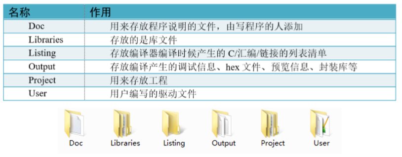

# STM32学习

> GuoXu
>
> 2022.3.16
>
> 基于 野火STM32F407教程 学习一下嵌入式知识，起到系统的学习巩固作用

---

## 一、基础常识

### 1.1 芯片

芯片四周是引脚，左下角的小圆点表示 1 脚，然后从 1 脚起按照逆时针的顺序排列（所有芯片 的引脚顺序都是逆时针排列的）


芯片内核和外设之间通过各种总线连接，其中主控总线有 8 条，被控总线有 7 条，具体见图 STM32F407xx 器件的总线接口 。主控总线通过一个总线矩阵来连接被控总线，总线矩阵用于主控总线之间的访问仲裁管理，仲裁采用循环调度算法。总线之间交叉的时候如果有个圆圈则表示 可以通信，没有圆圈则表示不可以通信。比如S0：I总线只有跟M0、M2和M6这三根被控总线 交叉的时候才有圆圈，就表示S0只能跟这三根被控总线通信。从功能上来理解，I总线是指令总 线，用来取指，指令指的是编译好的程序指令。我们知道STM32有三种启动方式，从FLASH启 动（包含系统存储器），从内部SRAM启动，从外部RAM启动，这三种存储器刚好对应的就是 M0、M2和M6这三条总线。


### 1.2 位操作

#### 1.2.1 某位清零

```c
// 定义一个变量 a = 1001 1111 b ( 二进制数 )
unsigned char a = 0x9f;

// 对bit2清零
a &= ~(1<<2);

// 括号中的1左移两位， (1<<2)得二进制数： 0000 0100 b
// 按位取反， ~(1<<2)得1111 1011 b
// 假如a中原来的值为二进制数：a = 1001 1111 b
// 所得的数与a作”位与 & ”运算， a = (1001 1111 b)&(1111 1011 b),
// 经过运算后， a的值a=1001 1011 b
// a的bit2位被被零，而其它位不变。
```

#### 1.2.2 连续位清零

```c
// 若把a中的二进制位分成2个一组
// 即bit0 、 bit1为第0组， bit2 、 bit3为第1组，
//   bit4 、 bit5为第2组， bit6 、 bit7为第3组
// 要对第1组的bit2 、 bit3清零

a &= ~(3<<2*1);

```

#### 1.2.3 对某几位进行赋值

```c
//a = 1000 0011 b 
// 此时对清零后的第2组bit4 、 bit5设置成二进制数“ 01 b"

a |= (1<<2*2); 
//a = 1001 0011 b ，成功设置了第2组的值，其它组不变
```

#### 1.2.4 对变量某位取反

```c
//a = 1001 0011 b
// 把bit6取反，其它位不变

a ^=(1<<6); 
//a = 1101 0011 b
```

### 1.3 GPIO


#### 1.3.1基本工作结构解读

- 内部上拉下拉

    STM32的内部上拉是“弱上拉”，即通过此上拉输出的电流是很弱的，如要求大电流还是需要外部上拉。

- 推挽与开漏输出

    (1) 推挽输出

    所谓的推挽输出模式，是根据这两个 MOS 管的工作方式来命名的。在该结构中输入高电平时， 经过反向后，上方的P-MOS导通，下方的N-MOS关闭，对外输出高电平；而在该结构中输入低电平时，经过反向后，N-MOS管导通，P-MOS关闭，对外输出低电平。当引脚高低电平切换时， 两个管子轮流导通，P管负责灌电流，N管负责拉电流，使其负载能力和开关速度都比普通的方式有很大的提高。推挽输出的低电平为0伏，高电平为3.3伏，具体参考图推挽等效电路，它是推挽输出模式时的等效电路。


- 开漏模式

    而在开漏输出模式时，上方的P-MOS管完全不工作。如果我们控制输出为0，低电平，则 P-MOS 管关闭，N-MOS管导通，使输出接地，若控制输出为1(它无法直接输出高电平)时，则P-MOS 管和N-MOS管都关闭，所以引脚既不输出高电平，也不输出低电平，为高阻态。**为正常使用时必须外部接上拉电阻**，参考图开漏电路中等效电路。它具有“线与”特性，也就是说，若有很多 个开漏模式引脚连接到一起时，只有当所有引脚都输出高阻态，才由上拉电阻提供高电平，此高电平的电压为外部上拉电阻所接的电源的电压。若其中一个引脚为低电平，那线路就相当于短路接地，使得整条线路都为低电平，0伏。


*推挽输出模式一般应用在输出电平为 0 和 3.3 伏而且需要高速切换开关状态的场合。在 STM32 的应用中，除了必须用开漏模式的场合，我们都习惯使用推挽输出模式。 开漏输出一般应用在I2C、SMBUS通讯等需要“线与”功能的总线电路中。除此之外，还用在电 平不匹配的场合，如需要输出 5 伏的高电平，就可以在外部接一个上拉电阻，上拉电源为 5 伏， 并且把GPIO设置为开漏模式，当输出高阻态时，由上拉电阻和电源向外输出5伏的电平，具体 见图STM32_IO对外输出5V电平。*


上图中通过两级三极管使得输入与输出相同。

- **复用输出**

    “复用功能输出”中的“复用”是指STM32的其它片上外设对GPIO引脚进行控制，此时GPIO引 脚用作该外设功能的一部分，算是第二用途。从其它外设引出来的“复用功能输出信号”与GPIO 本身的数据据寄存器都连接到双MOS管结构的输入中，通过图中的梯形结构作为开关切换选择。 例如我们使用USART串口通讯时，需要用到某个GPIO引脚作为通讯发送引脚，这个时候就可以把该GPIO引脚配置成USART串口复用功能，由串口外设控制该引脚，发送数据。

- **输入数据寄存器**

    看 GPIO 结构框图的上半部分，它是 GPIO 引脚经过上、下拉电阻后引入的，它连接到施密特 触发器，信号经过触发器后，模拟信号转化为0、1的数字信号，然后存储在“输入数据寄存器 GPIOx_IDR”中，通过读取该寄存器就可以了解GPIO引脚的电平状态。

- **复用功能输入**

    与“复用功能输出”模式类似，在“复用功能输出模式”时，GPIO引脚的信号传输到STM32其 它片上外设，由该外设读取引脚状态。 同样，如我们使用USART串口通讯时，需要用到某个GPIO引脚作为通讯接收引脚，这个时候 就可以把该GPIO引脚配置成USART串口复用功能，使USART可以通过该通讯引脚的接收远端 数据

- 模拟输入输出

    当 GPIO 引脚用于 ADC 采集电压的输入通道时，用作“模拟输入”功能，此时信号是不经过施 密特触发器的，因为经过施密特触发器后信号只有0、1两种状态，所以ADC外设要采集到原始 的模拟信号，信号源输入必须在施密特触发器之前。类似地，当 GPIO 引脚用于 DAC 作为模拟 电压输出通道时，此时作为“模拟输出”功能，DAC的模拟信号输出就不经过双MOS管结构了， 在GPIO结构框图的右下角处，模拟信号直接输出到引脚。同时，当GPIO用于模拟功能时(包括 输入输出)，引脚的上、下拉电阻是不起作用的，这个时候即使在寄存器配置了上拉或下拉模式， 也不会影响到模拟信号的输入输出

#### 1.3.2 GPIO 工作模式

- **输入模式(上拉/下拉/浮空)**
    在输入模式时，施密特触发器打开，输出被禁止。数据寄存器每隔 1 个 AHB1 时钟周期更新一 次，可通过输入数据寄存器GPIOx_IDR读取I/O状态。其中AHB1的时钟如按默认配置一般为 180MHz。 用于输入模式时，可设置为上拉、下拉或浮空模式。

- **输出模式(推挽/开漏，上拉/下拉)**
    在输出模式中，输出使能，推挽模式时双MOS管以方式工作，输出数据寄存器GPIOx_ODR可 控制 I/O 输出高低电平。开漏模式时，只有 N-MOS 管工作，输出数据寄存器可控制 I/O 输出高 阻态或低电平。输出速度可配置，有2MHz25MHz50MHz100MHz的选项。此处的输出速度即I/O 支持的高低电平状态最高切换频率，支持的频率越高，功耗越大，如果功耗要求不严格，把速度 设置成最大即可。 此时施密特触发器是打开的，即输入可用，通过输入数据寄存器 GPIOx_IDR 可读取 I/O 的实际 状态。
    用于输出模式时，可使用上拉、下拉模式或浮空模式。但此时由于输出模式时引脚电平会受到 ODR寄存器影响，而ODR寄存器对应引脚的位为0，即引脚初始化后默认输出低电平，所以在 这种情况下，上拉只起到小幅提高输出电流能力，但不会影响引脚的默认状态。

- **复用功能(推挽/开漏，上拉/下拉)**
    复用功能模式中，输出使能，输出速度可配置，可**工作在开漏及推挽模式，但是输出信号源于其 它外设，输出数据寄存器GPIOx_ODR无效**；输入可用，通过输入数据寄存器可获取I/O实际状 态，但一般直接用外设的寄存器来获取该数据信号。
    用于复用功能时，可使用上拉、下拉模式或浮空模式。同输出模式，在这种情况下，初始化后引 脚默认输出低电平，上拉只起到小幅提高输出电流能力，但不会影响引脚的默认状态。

- **模拟输入输出**
    模拟输入输出模式中，双MOS管结构被关闭，施密特触发器停用，上/下拉也被禁止。其它外设 通过模拟通道进行输入输出。

#### 1.3.3 外设时钟

为STM32外设很多，为了降低功耗，每个外设都对应着一个时钟，在芯片刚上电的时候这些时 钟都是被关闭的，如果想要外设工作，必须把相应的时钟打开。 

STM32 的所有外设的时钟由一个专门的外设来管理，叫 RCC（reset and clockcontrol）

所有的 GPIO 都挂载到 AHB1 总线上，所以它们的时钟由 AHB1 外设时钟使能寄存器 (RCC_AHB1ENR)来控制

## 二、固件库

### 2.1 CMSIS标准及库层次关系

因为基于Cortex系列芯片采用的内核都是相同的，区别主要为核外的片上外设的差异，这些差异 却导致软件在同内核，不同外设的芯片上移植困难。为了解决不同的芯片厂商生产的 Cortex 微 控制器软件的兼容性问题，ARM与芯片厂商建立了CMSIS标准(CortexMicroControllerSoftware InterfaceStandard)。


可见CMSIS层位于硬件层与操作系统或用户层之间，提供了与芯片生产商无关的硬件抽象层，可 以为接口外设、实时操作系统提供简单的处理器软件接口，屏蔽了硬件差异，这对软件的移植是 有极大的好处的。STM32的库，就是按照CMSIS标准建立的。

2.1.1 库目录文件简介


- Libraries：文件夹下是驱动库的源代码及启动文件。 
- Project：文件夹下是用驱动库写的例子和工程模板。
- Utilities：包含了基于ST官方实验板的例程，以及第三方软件库，如emwin图形软件库、fatfs 文件系统。 
- MCD-STLiberty⋯：库文件的License说明。 
- Release_Note.html:：库的版本更新说明。 
- stm32f4xx_dsp_stdperiph⋯：库帮助文档，这是一个已经编译好的HTML文件

先看看CMSIS文件夹。 STM32F4xx_DSP_StdPeriph_Lib_V1.8.0\Libraries\CMSIS\文件夹下内容见图CMSIS文件夹内容


其中Device与Include中的文件是我们使用得最多的，先讲解这两个文件夹中的内容。

#### Include文件夹

在Include文件夹中包含了的是位于CMSIS标准的核内设备函数层的Cortex-M核通用的头文件， 它们的作用是为那些采用Cortex-M核设计SOC的芯片商设计的芯片外设提供一个进入内核的接 口，

我们写STM32F4的工程，必须用到其中的四个文件：

core_cm4.h
core_cmFunc.h
corecmInstr.h
core_cmSimd.h

core_cm4.c文件有一些与编译器相关条件编译语句，用于屏蔽不同编译器的差异。

core_cm4.c跟启动文件一样都是底层文件，都是由ARM公司提供的，遵守CMSIS标准，即所有 CM4芯片的库都带有这个文件，这样软件在不同的CM4芯片的移植工作就得以简化。

####  Device文件夹

在 Device 文件夹下的是具体芯片直接相关的文件，包含启动文件、芯片外设寄存器定义、系统 时钟初始化功能的一些文件，这是由ST公司提供的。 

- system_stm32f4xx.c文件 
    
    文件目录：\Libraries\CMSIS\Device\ST\STM32F4xx\Source\Templates 
    
    这个文件包含了STM32芯片上电后初始化系统时钟、扩展外部存储器用的函数，例如我们前两 章提到供启动文件调用的“SystemInit”函数，用于上电后初始化时钟，该函数的定义就存储在 system_stm32f4xx.c文件。STM32F429系列的芯片，调用库的这个SystemInit函数后，系统时钟被初始化为180MHz，如有需要可以修改这个文件的内容，设置成自己所需的时钟频率。 
    
- 启动文件 
    文件目录：Libraries\CMSIS\Device\ST\STM32F4xx\Source\Templates 
    在这个目录下，还有很多文件夹，如“ARM”、“gcc_ride7”、“iar”等，这些文件夹下包含了对应编译平台的汇编启动文件，在实际使用时要根据编译平台来选择。我们使用的MDK启动文件在 “ARM”文件夹中。其中的 “strartup_stm32f40xx.s” 即为STM32F407芯片的启动文件，

- stm32f4xx.h文件 
    文件目录：Libraries\CMSIS\Device\ST\STM32F4xx\Include stm32f4xx.h
    这个文件非常重要，是一个STM32芯片底层相关的文件。它是我们前两章自己定义 的“stm32f4xx.h”文件的完整版，包含了STM32中所有的外设寄存器地址和结构体类型定义，在 使用到STM32标准库的地方都要包含这个头文件。 
    
- STM32F4xx_StdPeriph_Driver文件夹

    文件目录：Libraries\STM32F4xx_StdPeriph_Driver 进入libraries目录下的STM32F4xx_StdPeriph_Driver文件夹

    

    STM32F4xx_StdPeriph_Driver文件夹下有inc（include的缩写）跟src（source的简写）这两个文件 夹，这里的文件属于CMSIS之外的的、芯片片上外设部分。src里面是每个设备外设的驱动源程 序，inc则是相对应的外设头文件。

    

    这两个文件夹中，还有一个很特别的misc.c文件，这个文件提供了外设对内核中的NVIC(中断向 量控制器)的访问函数，在配置中断时，我们必须把这个文件添加到工程中。

- stm32f4xx_it.c、stm32f4xx_conf.h文件

    文件目录：STM32F4xx_DSP_StdPeriph_Lib_V1.8.0\Project\STM32F4xx_StdPeriph_Templates 在这个文件目录下，存放了官方的一个库工程模板，我们在用库建立一个完整的工程时，还需要 添加这个目录下的stm32f4xx_it.c、stm32f4xx_it.h、stm32f4xx_conf.h这三个文件。 

    stm32f4xx_it.c：这个文件是专门用来编写中断服务函数的，在我们修改前，这个文件已经定义了 一些系统异常 (特殊中断) 的接口，其它普通中断服务函数由我们自己添加

    stm32f4xx_conf.h：这个文件被包含进stm32f4xx.h文件。ST标准库支持所有STM32F4型号的芯 片，但有的型号芯片外设功能比较多，所以使用这个配置文件根据芯片型号增减ST库的外设文 件，

#### 库各文件间的关系


## 三、创建工程模板




